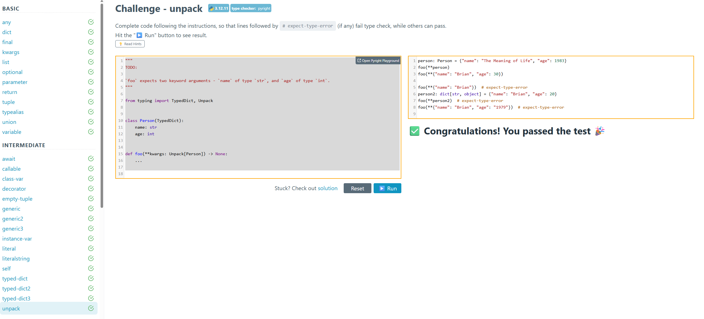

# Otus Python Developer Professional - Type Annotations Homework

This repository contains my solutions for the type annotation challenges from [python-type-challenges.zeabur.app](https://python-type-challenges.zeabur.app).

## Completed Levels

I have successfully completed exercises for the following levels:
- **Basic**
- **Intermediate**

The solution files are located in the `tasks/` directory, organized by difficulty level.

## Features

### Helper Script
A utility script `load_test_codes.py` was created to parse and download the challenge code snippets directly from the website to the local workspace.

### Docker Support
The project includes a `Dockerfile` to run type checks in an isolated environment.

1. Build the Docker image:
```bash
make build
```

2. Run type checks:
```bash
make typing
```

### GitHub Actions CI
A GitHub Actions workflow is set up to automatically run `mypy` checks on every push to the repository, ensuring type safety is maintained.

## Screenshot of completed tasks

